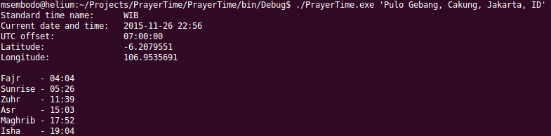

# PrayerTime
Muslims' prayer time in command line

This command line tool will display prayer times for actual date and local time. Since it takes location string as argument, the location needs to be in quotation mark and it can be as simple as -- for example 'London, UK'.

