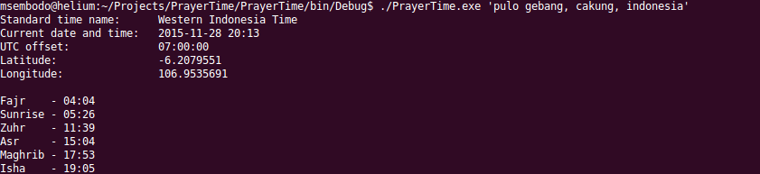
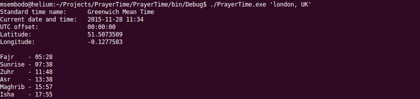

# PrayerTime
Muslims' prayer time in command line

This command line tool will display prayer times for actual date in a desired local time. Since it takes location string as argument, the location needs to be in quotation mark and it can be as simple as -- for example 'houston, US', or a bit more detail like 'pulo gebang, cakung, jakarta, indonesia'. As it uses Google Maps API to get latitude and longitude, more accurate location may give more precise prayer time.

You can also use it for finding out prayer time in any location on the surface of the earth.

